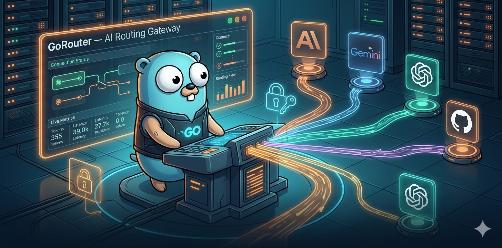
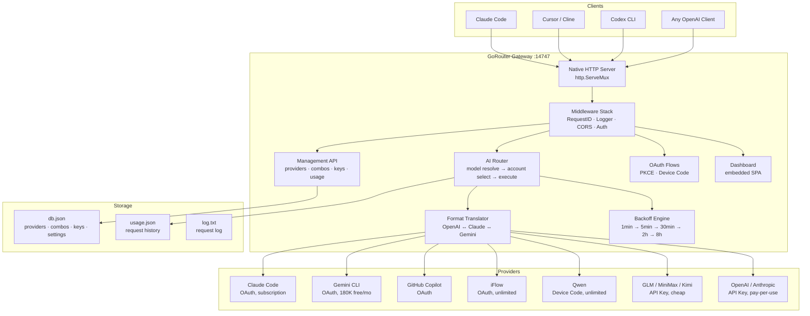

# GoRouter



[](https://go.dev/) [](https://hub.docker.com/) [](https://openai.com/) [](https://www.anthropic.com/) [](https://ai.google.dev/) [](LICENSE)

**GoRouter** is a single-binary AI routing gateway that auto-routes to free & cheap AI models with smart fallback — handling format translation, quota tracking, OAuth token refresh, and multi-account load balancing so you never hit a wall mid-session.

> [!IMPORTANT]
> **This repo is intended for local testing and development only.** OAuth login is provided for development convenience. For production, use provider API keys directly (OpenAI, Anthropic, Google, etc.) with proper key management and rate limiting.

## What Makes It Different

- **Zero-Config Multi-Provider** — Connect Claude Code, Gemini CLI, OpenAI, GitHub Copilot, iFlow, Qwen with OAuth in one click — no API keys needed for free tiers
- **Combo Fallback Chains** — Name a stack of models (e.g. `cc/opus → glm/glm-4.7 → if/kimi`) and GoRouter auto-falls through on quota/rate errors
- **Format Translation** — Accepts OpenAI format, translates to Claude Messages API or Gemini on the fly, translates streaming responses back
- **Account-Level Routing** — Multiple accounts per provider with fill-first or round-robin strategies and 5-level exponential backoff
- **Native HTTP Gateway** — Pure Go, `http.ServeMux` (Go 1.25+), no framework dependencies, ~15MB binary
- **ServiceGroup Lifecycle** — Concurrent startup and reverse-order graceful shutdown with signal handling

## Architecture



## Features

### AI Routing
- **Model Resolution** — Parse `provider/model`, resolve aliases, match combo names
- **Account Selection** — Fill-first (exhaust highest-priority) or round-robin with sticky window
- **Multi-Account Fallback** — 429/503 → try next account, 5-level exponential backoff
- **Combo Chains** — Named model sequences with automatic fall-through on quota exhaustion
- **SSE Streaming** — Full streaming proxy with format translation between all providers

### Format Translation
- **Request Translation** — OpenAI messages → Claude Messages API / Gemini, including tools and system prompts
- **Stream Translation** — Claude/Gemini SSE back to OpenAI `data: {"choices":[...]}` format
- **Auto-Detection** — Detects source format from request body structure

### Provider Support
- **7+ providers** — Claude Code, Gemini CLI, OpenAI, GitHub Copilot, iFlow, Qwen, GLM, MiniMax, Kimi, Anthropic, OpenRouter
- **OAuth PKCE** — One-click browser auth for Claude Code, Gemini CLI, OpenAI, GitHub Copilot, iFlow
- **Device Code** — Qwen auth without browser redirect
- **Token Auto-Refresh** — Automatic token renewal before expiry (5-minute buffer)

### Infrastructure
- **Pure Go** — No cgo, no framework dependencies, easy cross-compilation
- **Native HTTP** — `http.ServeMux` (Go 1.25+) with method+path patterns, custom middleware stack
- **ServiceGroup** — Concurrent startup, LIFO graceful shutdown, SIGINT/SIGTERM handling
- **Clean Architecture** — Domain interfaces (`domain/store.go`) with JSON file implementation
- **Embedded Dashboard** — SPA served from embedded filesystem
- **Usage Tracking** — Per-provider/model token counting, cost estimation, SSE live feed

## Quick Start

### Option 1: Build from Source

```bash
git clone <repo> && cd gorouter
cp .env.example .env   # edit secrets
make build
./gorouter             # starts on :14747
```

Point your CLI tool at `http://localhost:14747/v1` — done.

### Option 2: Docker

```bash
docker build -t gorouter .
docker run -d \
  --name gorouter \
  -p 14747:14747 \
  -v gorouter-data:/app/data \
  -e JWT_SECRET=your-secret \
  gorouter
```

### Option 3: Docker Compose

```bash
cd deployments
cp .env.example .env   # add your secrets
docker compose up -d
```

## Configuration

All settings via environment variables or `.env` file:

<details>
<summary><strong>Environment Variables</strong></summary>

| Variable | Default | Description |
|----------|---------|-------------|
| `PORT` | `14747` | Listen port |
| `HOSTNAME` | `0.0.0.0` | Bind address |
| `JWT_SECRET` | _(weak default)_ | Dashboard session secret — **change in production** |
| `INITIAL_PASSWORD` | `123456` | First login password |
| `DATA_DIR` | `~/.gorouter` | Config + usage storage directory |
| `API_KEY_SECRET` | _(default)_ | HMAC secret for API key generation |
| `REQUIRE_API_KEY` | `false` | Enforce Bearer key on `/v1/*` routes |
| `ENABLE_REQUEST_LOGS` | `false` | Log full request/response bodies |
| `BASE_URL` | `http://localhost:14747` | Public base URL (used in OAuth callbacks) |
| `DASHBOARD_URL` | _(empty)_ | Proxy dashboard to this URL (dev mode) |
| `HTTP_PROXY` / `HTTPS_PROXY` | _(empty)_ | Outbound proxy for upstream calls |

</details>

## Providers

### OAuth Providers

Connect via dashboard → `/api/oauth/{provider}/authorize`

| Key | Provider | Cost |
|-----|----------|------|
| `cc` | Claude Code | Pro/Max subscription |
| `gc` | Gemini CLI | Free (180K tokens/month) |
| `cx` | OpenAI (Codex) | Plus/Pro subscription |
| `gh` | GitHub Copilot | $10–19/mo |
| `if` | iFlow | Free (unlimited) |
| `qw` | Qwen | Free (unlimited) |

### API Key Providers

Add key via dashboard → Providers

| Key | Provider | Cost |
|-----|----------|------|
| `glm` | Zhipu GLM-4.7 | ~$0.6/1M tokens |
| `minimax` | MiniMax M2.1 | ~$0.2/1M tokens |
| `kimi` | Moonshot Kimi | $9/mo flat |
| `openai` | OpenAI | Pay per use |
| `anthropic` | Anthropic direct | Pay per use |
| `openrouter` | OpenRouter | Pay per use |

Model format: `{provider}/{model}` — e.g. `cc/claude-opus-4-6`, `if/kimi-k2-thinking`

## Combos — Auto Fallback Chains

Create a named combo that automatically falls through to the next model when quota runs out:

```bash
curl -X POST http://localhost:14747/api/combos \
  -H "Content-Type: application/json" \
  -d '{
    "name": "my-stack",
    "models": [
      "cc/claude-opus-4-6",
      "glm/glm-4.7",
      "if/kimi-k2-thinking"
    ]
  }'
```

Use `my-stack` as the model name in any client — GoRouter handles the rest.

**Example strategies:**

```
# Zero cost
gc/gemini-2.5-pro → if/kimi-k2-thinking → qw/qwen3-coder-plus

# Maximize subscription
cc/claude-opus-4-6 → glm/glm-4.7 → if/kimi-k2-thinking

# Always on (5 layers)
cc/claude-opus-4-6 → gh/claude-4.5-sonnet → glm/glm-4.7 → minimax/MiniMax-M2.1 → if/kimi-k2-thinking
```

## API Reference

### AI Routing (OpenAI-compatible)

```
POST /v1/chat/completions    OpenAI format
POST /v1/messages            Claude Messages API format
POST /v1/responses           OpenAI Responses API format
GET  /v1/models              List all providers + combos
```

<details>
<summary><strong>Management API</strong></summary>

```
POST /api/auth/login
POST /api/auth/logout
GET  /api/init

GET/PUT  /api/settings
POST     /api/settings/require-login

GET/POST        /api/providers
GET/PUT/DELETE  /api/providers/{id}
POST            /api/providers/{id}/test
GET             /api/providers/{id}/models
POST            /api/providers/validate

GET/POST        /api/combos
PUT/DELETE      /api/combos/{id}

GET/POST   /api/keys
DELETE     /api/keys/{id}

GET/POST   /api/models/alias
DELETE     /api/models/alias/{alias}

GET/POST        /api/provider-nodes
PUT/DELETE      /api/provider-nodes/{id}

GET /api/usage/providers      # stats by provider
GET /api/usage/request-logs   # paginated history
GET /api/usage/stream         # SSE live feed

GET/PUT /api/pricing

GET  /api/oauth/{provider}/authorize
GET  /api/oauth/{provider}/callback
POST /api/oauth/{provider}/device-code
POST /api/oauth/{provider}/poll
```

</details>

## CLI Tool Integration

**Claude Code** — `~/.claude/settings.json`:
```json
{
  "anthropic_api_base": "http://localhost:14747/v1",
  "anthropic_api_key": "your-gorouter-api-key"
}
```

**Cursor / Cline / Continue / RooCode:**
```
Provider:  OpenAI Compatible
Base URL:  http://localhost:14747/v1
API Key:   your-gorouter-api-key
Model:     cc/claude-opus-4-6  (or any combo name)
```

**Codex CLI:**
```bash
export OPENAI_BASE_URL="http://localhost:14747/v1"
export OPENAI_API_KEY="your-gorouter-api-key"
```

## Project Structure

```
cmd/gorouter/              Entrypoint (ServiceGroup lifecycle)
internal/
  errors/                  Structured error types with codes
  logging/                 slog wrapper with context-based request IDs
  lifecycle/               Service interface + ServiceGroup (concurrent start, LIFO stop)
  domain/                  Pure domain models + storage interfaces (Stores aggregate)
  storage/jsonfile/        JSON file store implementing domain interfaces
  config/                  Environment variable loading
  gateway/                 HTTP server, native ServeMux router, middleware, all handlers
  auth/                    JWT sessions, bcrypt passwords, HMAC API keys, machine ID
  translator/              Format translation (OpenAI ↔ Claude ↔ Gemini)
    request/               Request body translators
    response/              SSE stream translators
  executor/                Per-provider HTTP clients + token refresh
  router/                  Routing core: model resolve, account select, fallback, backoff
  oauth/                   OAuth PKCE flows + token refresh (cc / gc / cx / gh / if / qw)
    providers/             Per-provider OAuth config (endpoints, scopes, refresh)
  usage/                   Usage DB, cost estimation, logger, SSE broadcast
dashboard/                 Embedded SPA (static files)
```

## Development

```bash
make build        # compile binary
make run          # build + run on :14747
make test         # run tests
make test-cover   # coverage report
make docker       # build Docker image
make clean        # remove build artifacts
```

**Dashboard (dev mode)** — proxy to the JS frontend:
```bash
DASHBOARD_URL=http://localhost:3000 ./gorouter
```

## Roadmap

- [x] Phase 1 — Core routing engine (model resolve, account select, fallback)
- [x] Phase 2 — Format translation (OpenAI ↔ Claude ↔ Gemini)
- [x] Phase 3 — OAuth PKCE flows for 5 providers
- [x] Phase 4 — Management API (providers, combos, keys, settings)
- [x] Phase 5 — Usage tracking, cost estimation, SSE broadcast
- [x] Phase 6 — Dashboard (embedded SPA)
- [x] Phase 7 — Provider nodes (custom OpenAI/Anthropic endpoints)
- [x] Phase 8 — Pricing configuration
- [x] Phase 9 — Clean architecture refactor (native HTTP, domain interfaces, ServiceGroup)
- [ ] Phase 10 — Automated tests
- [ ] Phase 11 — Multi-tenant support
- [ ] Phase 12 — OTel observability

## Contributing

Contributions are what make the open source community such an amazing place to learn, inspire, and create. Any contributions you make are **greatly appreciated**.

1. Fork the Project
2. Create your Feature Branch (`git checkout -b feature/AmazingFeature`)
3. Commit your Changes (`git commit -m 'feat: Add some AmazingFeature'`)
4. Push to the Branch (`git push origin feature/AmazingFeature`)
5. Open a Pull Request

## License

MIT
